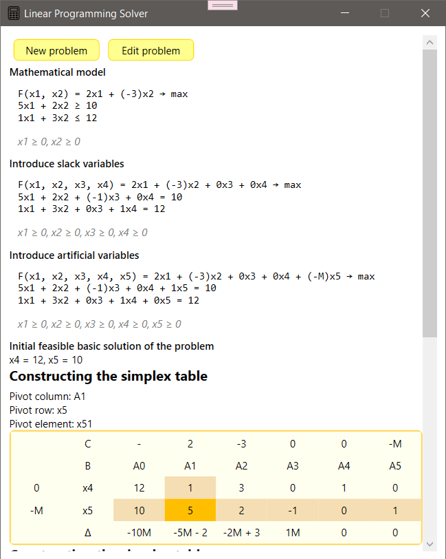

# Linear Programming Calculator

## Project Description :paperclip:

Linear Programming Calculator is a product that helps you solve LPPs using the simplex method for constraints that are greater than or equal to,
the Big M method for constraints that are less than or equal to or equal to, and finding integer solutions using Gomory cuts.

## Features :mag:

+ Primary Simplex method;
+ The Big M method;
+ Gomory Cutting Plane method.

## Installation :hammer:

**Clone Repository**
`git@github.com:varvaratrybiuk/Linear-Programming-Calculator.git`

**First way**

1. Navigate to the _dist_ folder
1. Double-click the _.exe_ file to launch the application

**Second way**

1. Open project in VS 2022
1. Make sure that you have a **.NET 8 SDK or newer**
1. Start the project (Press _F5_ or go to _Debug -> Start Debugging_)

## Getting Started :runner:

When you start the project, it displays a **Startup window** where you can set the number of variables and constraints.

Then, when you press _Generate Problem_, another window will appear where you can set up all the necessary parameters.
You can also **return to the startup window**, press _New Problem_, to edit the number of variables or constraints.

Finally, when you press _Solve_ button, the application navigates to the **Result window**, where you can view all steps of the problem?solving process.
Additionally, you can edit the current problem by pressing _Edit problem_, or start a new one by pressing _New problem_.

## Documentation

## License

This project is licensed under the [MIT](./LICENSE.md)

## Author

Author: Varvara Trybiuk
