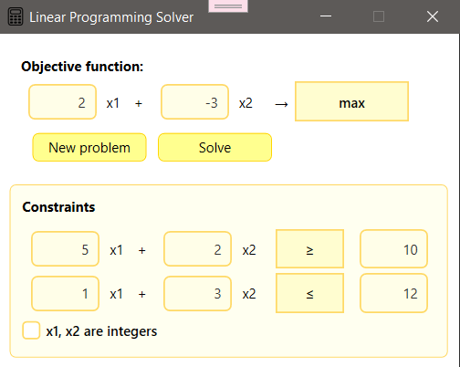
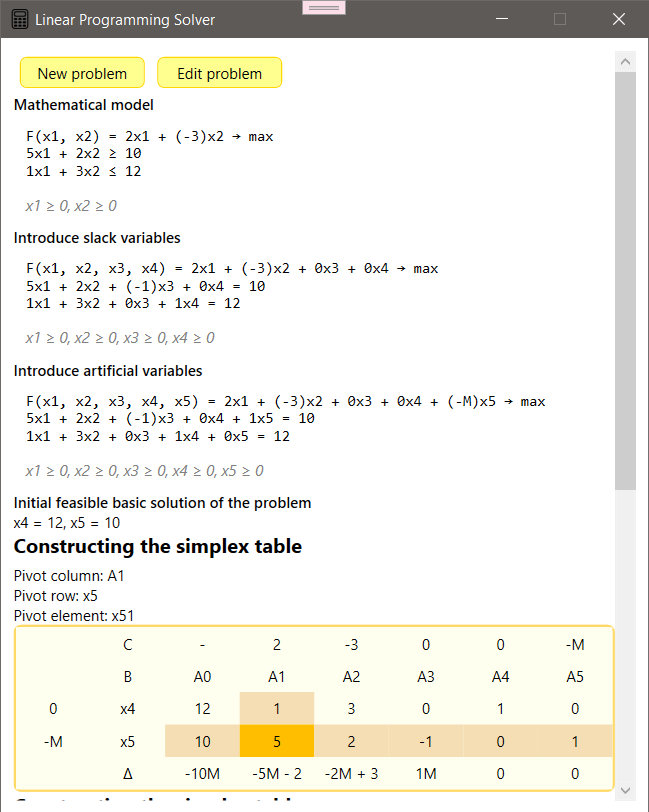

# Linear Programming Calculator

Linear Programming Calculator is a product that helps you solve LPPs using the simplex method for constraints that are greater than or equal to,
the Big M method for constraints that are less than or equal to or equal to, and finding integer solutions using Gomory cuts.

## Quick Start :runner::

When you start the project, it displays a **Startup window** where you can set the number of variables and constraints.

Then, when you press _Generate Problem_, another window will appear where you can set up all the necessary parameters.
You can also **return to the startup window**, press _New Problem_, to edit the number of variables or constraints.

Finally, when you press _Solve_ button, the application navigates to the **Result window**, where you can view all steps of the problem?solving process.
Additionally, you can edit the current problem by pressing _Edit problem_, or start a new one by pressing _New problem_.

